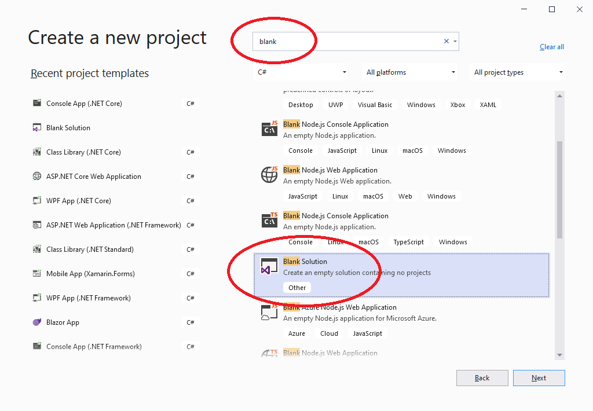
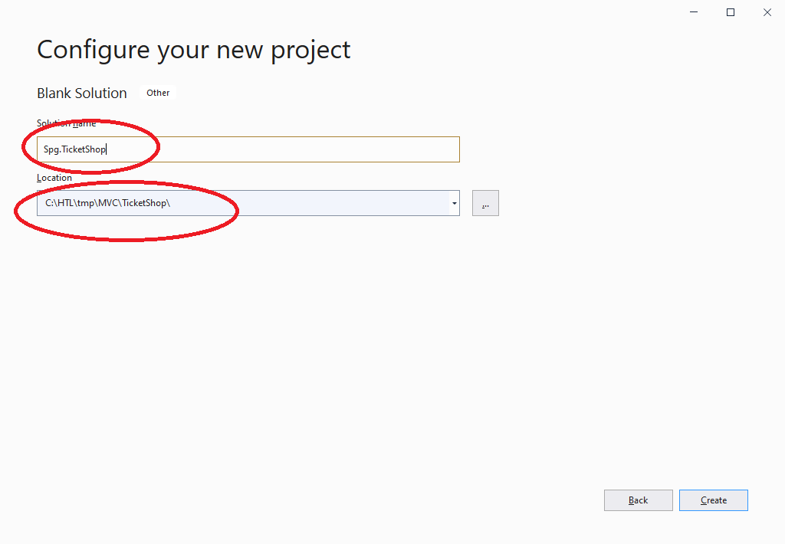
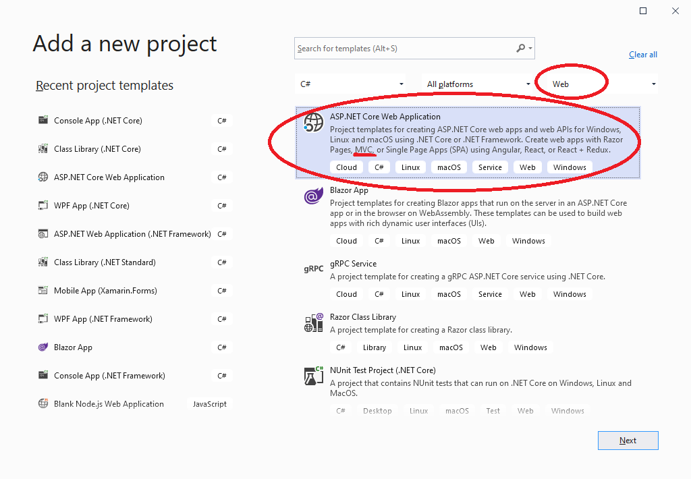
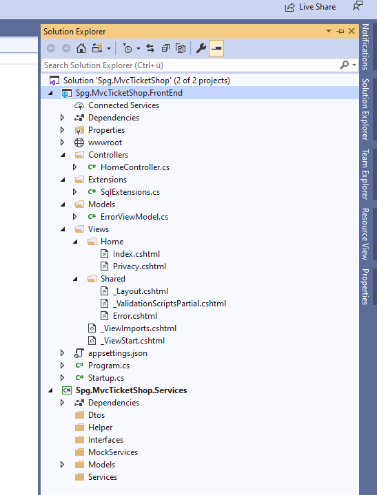
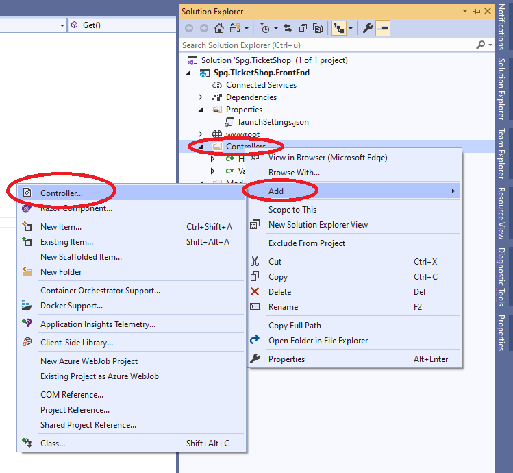
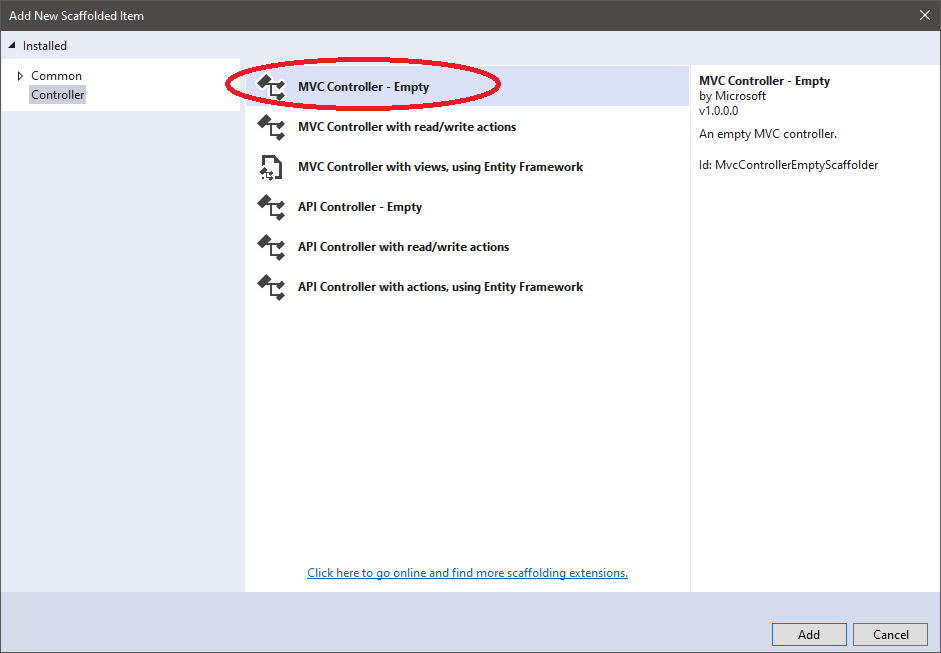
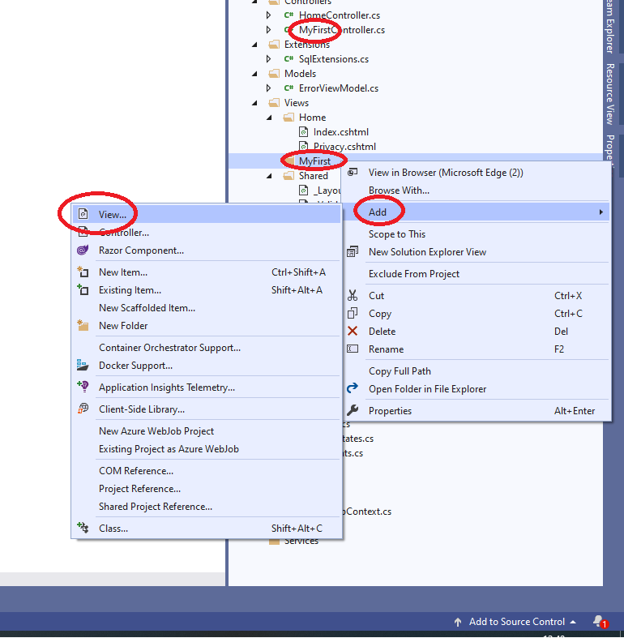
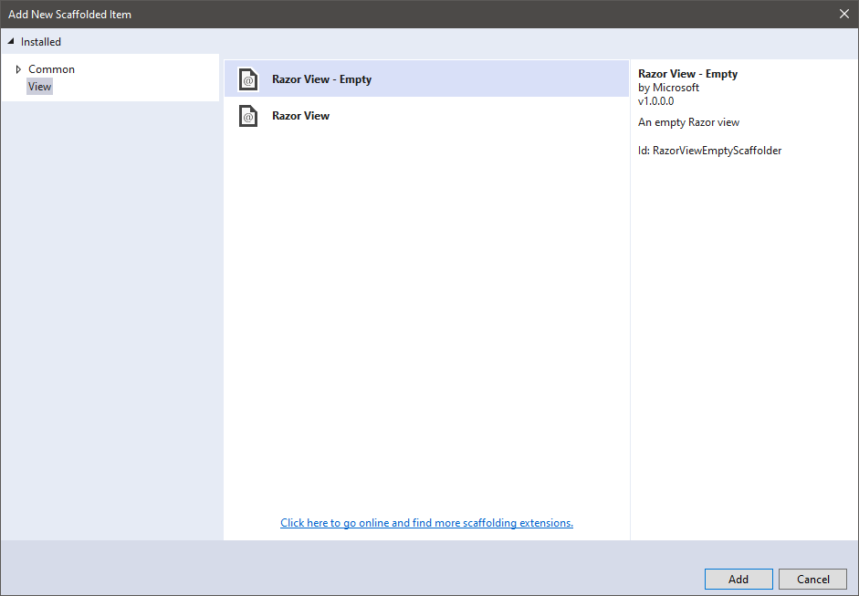
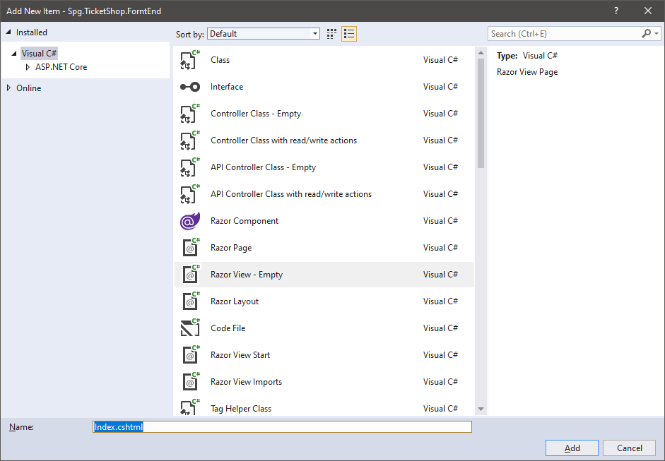
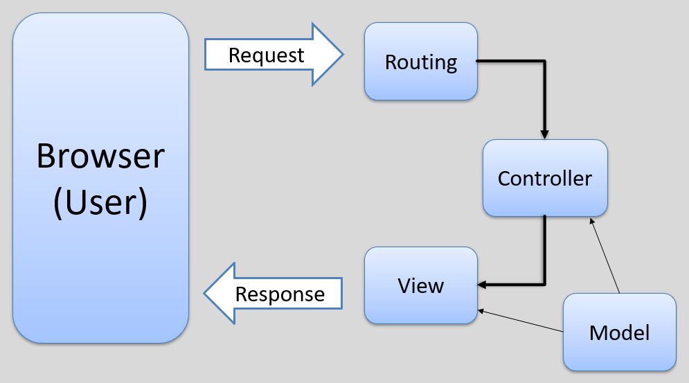

# ASP.net Core MVC

Auf MSDN ist sehr viel Information über ASP.Net Core verfügbar:

<https://docs.microsoft.com/de-at/aspnet/core/tutorials/first-mvc-app/start-mvc?view=aspnetcore-3.1&tabs=visual-studio>

## Projekt anlegen

Das Anlegen eines neuen Projektes nochmal zusammengefasst:

Eine "Blank Solution" anlegen. Darin werden dann alle weiteren Projekte angelegt.



Verzeichnis wählen, und den Namen vergeben. Die Konvention sieht vor: ``[Unternehmen].[Solutionname]``



Das Projekt hinzufügen. (ASP.NET Core Web-Application)




Die Konvention gibt vor, dass das Projekt in der Solution im Unterverzeichnis ``src`` angelegt wird.


MVC wählen


Das ist das Ergebnis im Solution Explorer


Wir legen ein weiters Projekt in der Solution an (Classs-Library(.NET Core))


## Projektstruktur

Das ist das Ergebnis im Solution Explorer. Es ist notwendig eine Dependency auf das Services-Projekt zu legen. (Dependencies, rechte Maustaste, ``Add Project Reference...)``



## Controller hinzufügen

Controller werden folgendermaßen hinzugefügt.

Achtung! Darauf achten, dass man sich im Controllers-Ordner befindet.






Der Controller übernimmt Parameter aus dem Query-String und stellt der View die Daten in Form eines Models bereit.

## View hinzufügen

Das gleiche gilt für die Views:







Die View zeigt die Daten aus dem Model an.

## Arbeiten mit Models

Das MVC-Pattern:



Fügen wir im Verzeichnis ``Models`` ein einfaches Model hinzu:

```C#
public class Guest
{
    public string FirstName { get; set; }

    public string LastName { get; set; }

    public string EMail { get; set; }
}
```

Die Verwendung im Controller wäre dann zum Beispiel:

```C#
[HttpGet()]
public IActionResult Guest()
{
    Guest guest = new Guest() { FirstName = "Martin", LastName = "Schrutek", EMail = "schrutek@spengergasse.at" };

    return View(guest);
}
```

## Data Annotations

Mit Attributen (Data Annotations) können im Model Datentypen, Überprüfungen, Begrenzungen, usw. festgelegt werden.

```C#
[Required]
[StringLength(250)]
public string Name { get; set; }
```

## Model State

Create Methode:
Eine Create View ohne DB zeigen, nur ModelState.IsValid. Wenn OK, redirect to Index, sonst return View(model);
if (ModelState.IsValid)

